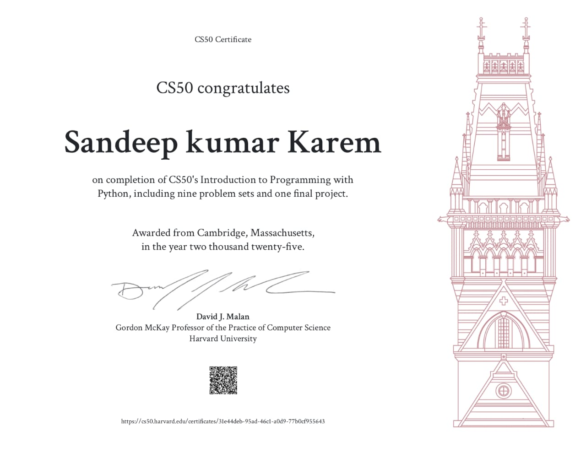
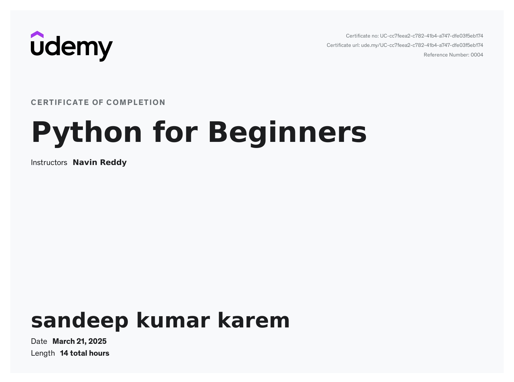
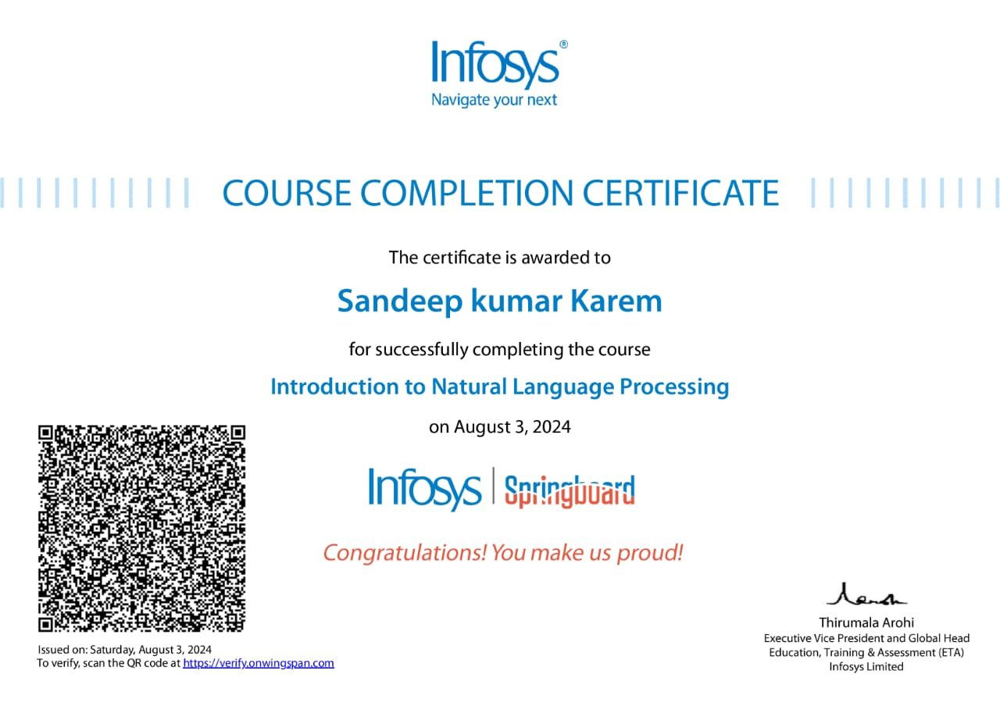

# Certifications
### Introduction to programming using Python by Cambridge, Massachusetts.
- https://certificates.cs50.io/31e44deb-95ad-46c1-a0d9-77b0cf955643.pdf?size=letter
  

### Python for beginners - Udemy
- https://www.udemy.com/certificate/UC-cc7feea2-c782-41b4-a747-dfe03f5eb174/

---
# [DataBase Management System (click here)](./Database_management_systems.pdf/)
---

### Introduction to Natural Language Processesing

---
# [Software Engineering and Agile Development](./software_engineering_and_Agile.pdf/)
---

# Skill Badges
### Skill Badges aquired from cloud skill boost by google.
- https://www.credly.com/users/sandeep-kumar-karem
